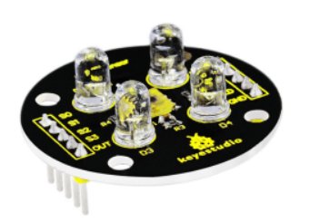
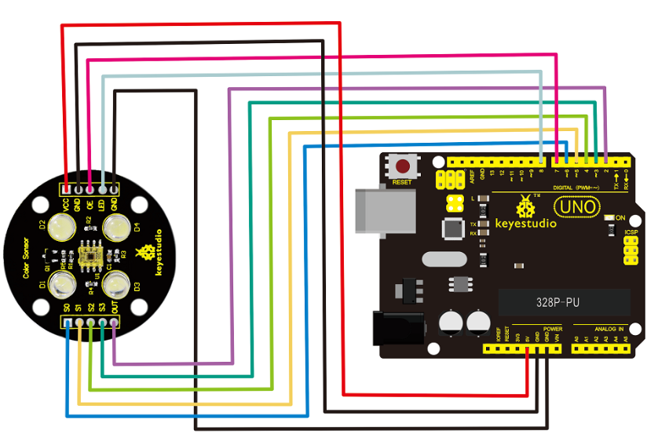
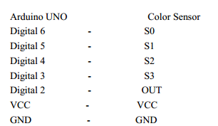

# KS0053 keyestudio Color Sensor

Download Resources: [Resources](./Resources.7z)



## 1. Introduction

TCS3200 programmable color light-to-frequency converter applies to colorimeter measurement such as color printing, medical diagnosis, calibration of PC color monitor as well as process control and color coordination in oil paint, textile, cosmetics and printing material industries.

TCS3200 is built on the principle of three primary colors. Concretely speaking, TCS3200 allows only one specific primary color to go through and blocks other primary colors if a specific color filter was chosen.

For example, when red filter was chosen, only red light can pass through while blue and green lights will be blocked out, so that we can get the intensity of red light. The strength of blue and green lights can be got in the same way. Finally, By analyzing the light strength of these three color, we can recognize the color reflected onto TCS3200.

## 2. Specification

- Color Recognition Sensor Module
- Condition: New
- Chip: TCS230
- Input voltage: DC 3 ~ 5V
- Output frequency voltage: 0 ~ 5V
- Use high brightness white LEDs
- Can be connected directly to Microcontroller
- Static detection of the measured object color
- Best detection distance: 10mm

**NOTE:** Due to lighting effects, difference in monitor's brightness/ contrast settings etc, there could be some slight differences in the color tone between the pictures and the actual item!

## 3. Connection Diagram



There are in total 10 pins on this sensor and among them, these two pins, namely GND and LED, are directly connected to each other by Jumper Cap.

There are in total 10 pins on this sensor. The following is the correct connection between this color sensor and Arduino UNO:



## 4. Sample Code

```
#include <TimerOne.h>
#define S0 6 // Please notice the Pin's define
#define S1 5
#define S2 4
#define S3 3
#define OUT 2
#define OE 7
#define LED 8
int g_count = 0; // count the frequecy
int g_array[3]; // store the RGB value
int g_flag = 0; // filter of RGB queue
float g_SF[3]; // save the RGB Scale factor
// Init TSC230 and setting Frequency.

void TSC_Init()
{
    pinMode(S0, OUTPUT);
    pinMode(S1, OUTPUT);
    pinMode(S2, OUTPUT);
    pinMode(S3, OUTPUT);
    pinMode(OUT, INPUT);
    digitalWrite(S0, LOW); // OUTPUT FREQUENCY SCALING 2%
    digitalWrite(S1, HIGH);
}

// Select the filter color
void TSC_FilterColor(int Level01, int Level02)
{
    if(Level01 != 0)
    	Level01 = HIGH;
    if(Level02 != 0)
    	Level02 = HIGH;
    digitalWrite(S2, Level01);
    digitalWrite(S3, Level02);
}

void TSC_Count()
{
	g_count ++ ;
}

void TSC_Callback()
{
	switch(g_flag)
    {
        case 0:
            Serial.println("->WB Start");
            TSC_WB(LOW, LOW); //Filter without Red
            break;
        case 1:
        	Serial.print("->Frequency R=");
            Serial.println(g_count);
            g_array[0] = g_count;
            TSC_WB(HIGH, HIGH); //Filter without Green
            break;
        case 2:
            Serial.print("->Frequency G=");
            Serial.println(g_count);
            g_array[1] = g_count;
            TSC_WB(LOW, HIGH); //Filter without Blue
            break;
        case 3:
            Serial.print("->Frequency B=");
            Serial.println(g_count);
            Serial.println("->WB End");
            g_array[2] = g_count;
            TSC_WB(HIGH, LOW); //Clear(no filter)
            break;
        default:
            g_count = 0;
            break;
   }
}

void TSC_WB(int Level0, int Level1) //White Balance
{
    g_count = 0;
    g_flag ++;
    TSC_FilterColor(Level0, Level1);
    Timer1.setPeriod(1000000); // set 1s period
}

void setup()
{
    pinMode(OE,OUTPUT);
    pinMode(LED,OUTPUT);
    digitalWrite(OE,LOW);
    digitalWrite(LED,LOW);
    TSC_Init();
    Serial.begin(9600);
    Timer1.initialize(); // defaulte is 1s
    Timer1.attachInterrupt(TSC_Callback);
    attachInterrupt(0, TSC_Count, RISING);
    delay(4000);
    for(int i=0; i<3; i++)
    Serial.println(g_array[i]);
    g_SF[0] = 255.0/ g_array[0]; //R Scale factor
    g_SF[1] = 255.0/ g_array[1] ; //G Scale factor
    g_SF[2] = 255.0/ g_array[2] ; //B Scale factor
    Serial.println(g_SF[0]);
    Serial.println(g_SF[1]);
    Serial.println(g_SF[2]);
}

void loop()
{
    g_flag = 0;
    for(int i=0; i<3; i++)
    Serial.println(int(g_array[i] * g_SF[i]));
    delay(4000);
}
```

